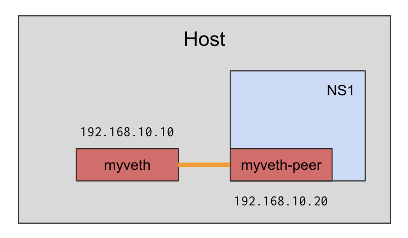

# Veth

An example of createing a simple network namespace connected to the host via a veth pair.



Create the VM:

```
vagrant up
```

SSH to the VM:

```
vagrant ssh
```

Create the network namespace and the veth pair:

```
./setup.sh
```

Test the connectivity between the host and the namespace:

```
./test.sh
```

And you can also run a server inside the namespace:

```
sudo ip netns exec NS1 python3 -m http.server 8000 > /dev/null 2>&1 &
```

Access it from outside the namespace:

```
curl 192.168.10.20:8000
```

Exit the VM:

```
exit
```

Destroy the VM:

```
vagrant destroy
```

